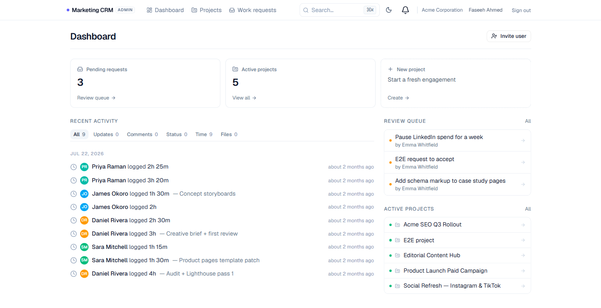
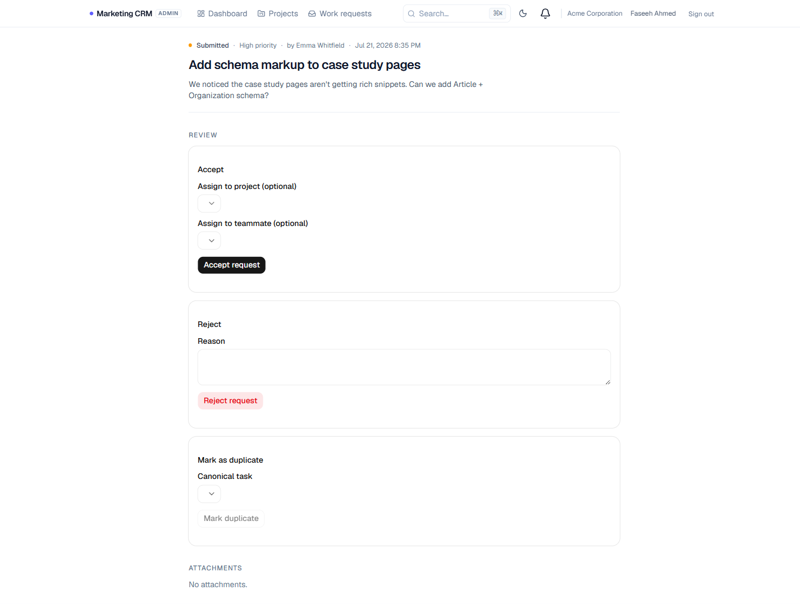
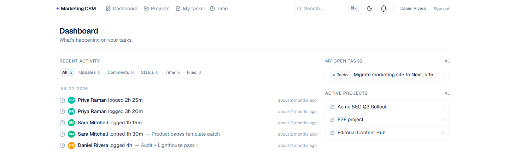
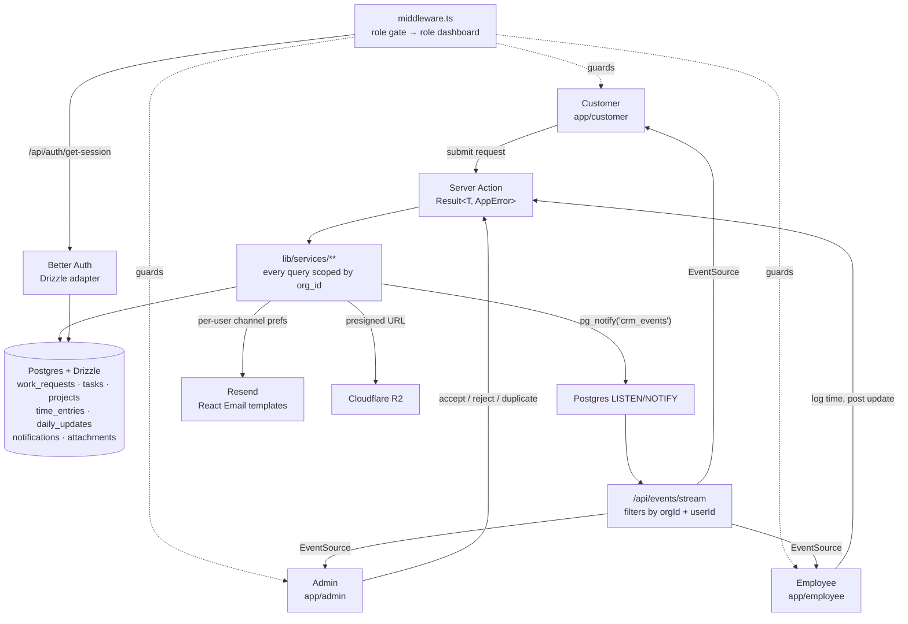

# FlowLeadz

**Multi-role marketing-agency CRM** — clients file work requests, admins triage them into projects and tasks, employees log time and post daily updates. Public marketing site and the CRM ship as one Next.js application.


## Live demo

🔗 **https://flowleadz.vercel.app**

Sign in with any of the three seeded accounts to see the app from that role's perspective:

| Role | Email | Password |
| --- | --- | --- |
| Admin | `admin@e2e.test` | `Passw0rd!Test123` |
| Employee | `employee@e2e.test` | `Passw0rd!Test123` |
| Customer | `customer@e2e.test` | `Passw0rd!Test123` |

This is a seeded demo sandbox on shared data — anyone can sign in, and changes you make are visible to the next visitor. Treat it as a scratchpad, not a private workspace.

## Screenshots

Admin dashboard — pending review queue, active projects, and a live activity feed:



Request triage — accept into a project and assign a teammate, reject with a reason, or mark as a duplicate of an existing task:



Employee dashboard — assigned tasks, project list, and the same activity feed scoped to the employee's work:



## What it does

- **Client work requests.** Customers submit a request with a title, description, optional target project, and priority hint. Submitting auto-creates a linked task, so nothing sits in an inbox untracked. Files attach through presigned Cloudflare R2 uploads in a two-phase pending → ready handshake, so the database never ends up claiming a file that was never uploaded.
- **Admin triage.** Admins accept a request into a project (optionally assigning a teammate in the same action), reject it with a reason, or mark it a duplicate of a canonical task. Every transition is written to an append-only status log.
- **Time logging and daily updates.** Employees log minutes against a task for a given date, and write daily updates tagged by activity type with either `customer_visible` or `internal_only` visibility. Both updates and comments keep a revision history.
- **Real-time notifications.** A write issues a Postgres `NOTIFY`; a Server-Sent Events endpoint fans it out to connected clients, dropping any payload that would cross an organization or user boundary. Each recipient's channel preferences are resolved per event type first — in-app becomes a row plus an SSE ping, email renders a React Email template through Resend — and a delivery row records `sent` or `failed` with the error, so a bounced notification is visible rather than silent.
- **Role-based access.** Three system roles — customer, employee, admin — gated in middleware and re-checked inside every service function. Customers only see tasks explicitly marked customer-visible.
- **Full-text search.** One search box across tasks, daily updates, and work requests, backed by Postgres `tsvector` with `ts_rank` ordering and `ts_headline` snippets. Task and update results are role-scoped in SQL: customers see only customer-visible rows, employees only projects they are assigned to, admins the whole organization.

## Architecture

One Next.js 15 App Router application, deployed to Vercel against Neon Postgres. Four route areas: the public marketing site (`app/(site)`), auth (`app/(auth)`), and three role-scoped CRM areas (`app/customer`, `app/employee`, `app/admin`). The site's CSS is scoped under `.site-scope` so marketing styles cannot leak into the CRM.

The codebase is **service-layer-first**. Every database query lives in `lib/services/**` and filters by `org_id`; Server Actions are thin wrappers that authenticate, delegate, and return a `Result<T, AppError>` rather than throwing. The boundary is mechanically enforced — ESLint's `no-restricted-imports` fails the build if anything outside `lib/services/**`, `lib/db/**`, or `lib/better-auth/**` imports the database client or schema.



**Request lifecycle.** A customer submits a work request; the service inserts the request, creates a task with `source = from_request`, links the two, writes a status-log row, and notifies every admin. On accept, the admin's chosen project is synced onto the linked task, an optional assignee is attached, the transition is logged, and the submitter is notified.

**Realtime.** After a write, the service calls `notify()`, which issues `SELECT pg_notify('crm_events', …)` with a compact JSON payload — either an activity event carrying a task id, or a personal notification carrying a user id. `/api/events/stream` opens a dedicated non-pooled `LISTEN` connection per client (Neon requires the direct endpoint for `LISTEN`), drops any payload whose `orgId` differs from the session's, additionally requires a matching `userId` for personal notifications, sends a keepalive comment every 25 s, and tears the stream down at 280 s to stay under the Vercel function ceiling. The stream opens with `retry: 1000`, so the browser's `EventSource` reconnects a second after each recycle.

**Auth.** Better Auth with the Drizzle adapter owns users, sessions, accounts, organizations, and invitations. Email and password (12-character minimum) plus magic links, with Google OAuth enabled only when its credentials are present. `systemRole` is an additional user field with `input: false`, so it cannot be set by a client during signup. `middleware.ts` checks the session against `/api/auth/get-session` and redirects any role that wanders outside its own area back to its dashboard.

Full design rationale: [`docs/superpowers/specs/2026-05-08-marketing-crm-phase-1-design.md`](docs/superpowers/specs/2026-05-08-marketing-crm-phase-1-design.md).

## Tech stack

| Layer | Choice | Why |
| --- | --- | --- |
| Framework | Next.js 15 (App Router), React 19 | Server Components keep role-scoped queries on the server; Server Actions remove a hand-written API layer. |
| Language | TypeScript (strict) | Service contracts and `Result` types stay checkable end to end. |
| Database | PostgreSQL 16 (Neon in production) | Relational data with real constraints, plus `LISTEN/NOTIFY` and full-text search built in. |
| ORM | Drizzle ORM + Drizzle Kit | SQL-shaped queries with generated migrations, and raw SQL where full-text search needs it. |
| Auth | Better Auth + organization and magic-link plugins | Sessions, OAuth, and org membership without hand-rolling credential handling. |
| Validation | Zod 4 + drizzle-zod | One schema per service input, reused for form errors and type inference. |
| Realtime | Postgres `LISTEN/NOTIFY` over SSE | No extra broker to run; events commit atomically with the write that caused them. |
| Styling | Tailwind CSS 4, shadcn/ui, Base UI | Small primitive set, accessible defaults, no component library to fight. |
| Files | Cloudflare R2 via AWS S3 SDK | S3-compatible presigned uploads that bypass the serverless request body limit. |
| Email | Resend + React Email | Templates written as React components, rendered to HTML and plain text from one source. |
| Logging | Pino | Structured JSON logs that Vercel's log drain can parse. |
| Tests | Vitest, Testing Library, Playwright | Unit and service-layer coverage against a real Postgres, plus browser tests for each role's happy path. |

## Running locally

Prerequisites: Node 20.18+, pnpm 9+, Docker.

```bash
# 1. Install dependencies
pnpm install

# 2. Start Postgres (host port 5433, to avoid clashing with a native Postgres on 5432)
docker compose up -d db

# 3. Configure environment
cp .env.example .env

# Generate the two required secrets and paste them into .env
node -e "console.log(require('crypto').randomBytes(32).toString('hex'))"   # BETTER_AUTH_SECRET
node -e "console.log(require('crypto').randomBytes(16).toString('hex'))"   # CRON_SECRET

# 4. Apply migrations
pnpm db:migrate

# 5. Seed the three demo users (admin / employee / customer @e2e.test)
pnpm tsx --env-file=.env scripts/dev-seed.ts

# Optional: richer demo data — extra staff, projects, tasks, time entries, updates
pnpm tsx --env-file=.env scripts/demo-seed.ts

# 6. Run
pnpm dev
```

Open http://localhost:3000 and sign in with any account from the [demo table](#live-demo).

After editing anything under `lib/db/schema/`, run `pnpm db:generate` to emit a migration and `pnpm db:migrate` to apply it; `pnpm db:studio` opens Drizzle Studio against the local database, and `pnpm tsx --env-file=.env scripts/dev-cleanup.ts` wipes seeded data.

`.env.example` lists every variable. Only `DATABASE_URL`, `BETTER_AUTH_SECRET`, `BETTER_AUTH_URL`, `APP_URL`, `NEXT_PUBLIC_APP_URL`, and `CRON_SECRET` are needed to boot. The rest — R2, Resend, Google OAuth, Airtable, Google Sheets, Cal.com — are optional; the features that use them fail only when invoked. Set `DISABLE_RATE_LIMIT=1` locally if you run the e2e suite, which signs in faster than Better Auth's default rate limit allows.

## Testing

```bash
pnpm test        # Vitest — 227 unit and service-layer integration cases
pnpm test:e2e    # Playwright — 11 browser specs across all three roles
pnpm typecheck   # tsc --noEmit
pnpm lint        # ESLint, including the service-layer import boundary
```

Integration tests run against the Dockerized Postgres rather than a mock, so `org_id` scoping and database constraints are covered by the same assertions as the business logic. CI (`.github/workflows/ci.yml`) runs lint, typecheck, and build in one job, unit and integration tests in another, and Playwright in a third.

## Project structure

```
app/
  (site)/            Public FlowLeadz marketing site — CSS scoped under .site-scope
  (auth)/            Login, signup, magic link, password reset, email verification
  customer/          Requests, projects, tasks, notifications, search
  employee/          Tasks, time logging, daily updates, projects, search
  admin/             Org switcher, work-request triage, projects, tasks, user invites
  api/
    auth/[...all]/   Better Auth handler
    events/stream/   SSE endpoint backed by Postgres LISTEN
    cron/gc-pending/ Nightly cron slot for the abandoned-upload sweep (see Deployment)
    contact/         Marketing-site lead capture
    cal-webhook/     Cal.com booking webhook

lib/
  services/          The only layer allowed to touch the database. One folder per domain.
  server-actions/    Thin Server Action wrappers returning Result<T, AppError>
  db/                Drizzle client, LISTEN client, schema, generated migrations
  better-auth/       Better Auth server config and React client
  notifications/     after()-based background dispatch helper
  email/             Resend transport, template registry, React Email templates
  storage/           R2 presigned upload and download

components/
  ui/                shadcn/ui primitives
  app/               CRM components (activity feed, task views, forms)
  site/              Marketing-site sections

scripts/             dev-seed, demo-seed, dev-cleanup, seed-admin (production bootstrap)
tests/               unit · integration (real Postgres) · e2e (Playwright)
docs/superpowers/    Design specs and phase plans
```

## Deployment

Deployed to Vercel with `pnpm build`. Migrations are applied out of band rather than during the build. Set `DATABASE_URL_UNPOOLED` alongside `DATABASE_URL` on Neon: the SSE `LISTEN` connection and migrations both need a direct, unpooled connection. `pnpm db:seed:admin` is a one-time bootstrap for the first admin account on a fresh deployment.

`vercel.json` registers one cron job — `/api/cron/gc-pending`, daily at 04:00, authenticated with a `Bearer $CRON_SECRET` header. **Known gap:** the collector itself (`attachments.gcPending`, which deletes R2 objects and rows for uploads still `pending` after an hour) is implemented and tested, but the route handler is still a stub that returns `{ deleted: 0 }` without calling it. Wiring the two together is the outstanding task.
